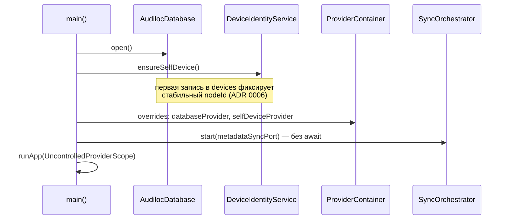

# Архитектура

## Слои

```
lib/
  main.dart, app.dart        — запуск: асинхронная инициализация до runApp
  core/
    theme/                   — тёмная тема (без брендинга, ТЗ п.1)
    router/                  — go_router: вкладки + деталка плейлиста
    providers.dart           — граф зависимостей (Riverpod)
  data/
    models/                  — Track, Playlist, PlaylistTrack/Item, Device
    db/                      — схема sqlite_crdt (docs/data-model.md)
    repositories/            — CRUD + watch() поверх CRDT-таблиц
  services/
    playback/                — PlayerService (интерфейс) + media_kit;
                                AudilocAudioHandler зеркалит его в
                                audio_service (лок-скрин/уведомление/
                                гарнитура, Android-only)
    library_import/          — скан папки → теги → sha256 id → tracks
    dedupe/                  — эвристика дублей (docs/adr/0007)
    sync/
      discovery/             — bonsoir: кто есть в LAN
      metadata/               — crdt_sync: обмен CRDT-дельтами
      files/                  — встроенный HTTP-сервер/клиент передачи
                                 файлов (docs/adr/0010), без сторонних программ
      device_identity_service — стабильный id этого устройства
      sync_orchestrator       — клей: discovery → metadata sync → devices
  features/
    library/ playlists/ search/ devices/ player/ shell/
                              — экраны, виджеты, feature-провайдеры
```

Правило зависимостей: `features` → `services`/`data`, `services` →
`data`, `data` ни от чего "выше" не зависит. `core/providers.dart` —
единственное место, которое знает про все слои сразу (граф DI).

## Поток запуска

`main()` делает асинхронную инициализацию **до** `runApp`, а не через
`FutureProvider` с состояниями загрузки по всему дереву виджетов:



Синхронизация запускается фоново и никогда не блокирует первый кадр
UI — офлайн-first в буквальном смысле (ТЗ п.7).

## Поток P2P-синхронизации метаданных

```mermaid
flowchart LR
    A[Устройство A] -- mDNS TXT: id, port --> Bonsoir((LAN mDNS))
    Bonsoir -- PeerFound --> B[Устройство B: DiscoveryService]
    B --> Orch[SyncOrchestrator]
    Orch -- upsert + connectToPeer --> Sync[MetadataSyncService]
    Sync -- CrdtSyncClient ws:// --> ServerA[Устройство A: crdt_sync listen()]
    ServerA -- changeset --> DB_A[(sqlite_crdt A)]
    Sync -- changeset --> DB_B[(sqlite_crdt B)]
```

Оба устройства симметричны: каждое одновременно слушает входящие
подключения и подключается исходящим `CrdtSyncClient` к обнаруженным
пирам ([ADR 0005](adr/0005-crdt-sync-for-p2p-metadata.md)).
Файлы по этому каналу не идут — только CRDT-дельты; за сами файлы
отвечает встроенный `FileTransferServer`/`FileTransferClient` отдельным
HTTP-каналом ([ADR 0010](adr/0010-built-in-file-transfer.md)):
`FileSyncService` следит за треками без локального файла и докачивает
их с первого online-пира, у которого файл есть.

## Тестируемость как следствие архитектуры

- `PlayerService` — интерфейс; UI и провайдеры никогда не видят
  `media_kit` напрямую → виджет-тесты используют `FakePlayerService`
  без нативных либ mpv.
- `TagReader` — обычный класс с одним переопределяемым методом →
  тесты импорта подменяют его без нативного `audiotags`.
- Репозитории принимают `SqliteCrdt`, а не путь к файлу →
  `SqliteCrdt.openInMemory()` даёт быстрые изолированные unit-тесты
  без диска.
- `databaseProvider`/`selfDeviceProvider` — плейсхолдеры,
  переопределяемые через `overrideWithValue` — виджет-тесты подставляют
  свою in-memory БД тем же способом, что и `main()`.
