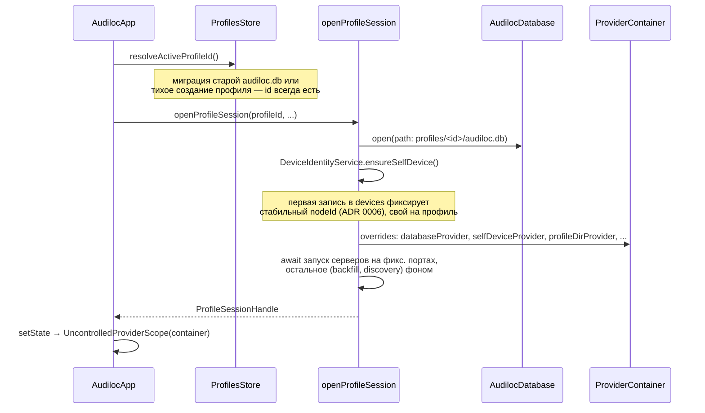
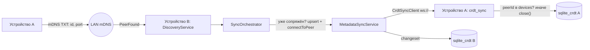

# Архитектура

## Слои

```
lib/
  main.dart                  — запуск: только runApp(AudilocApp())
  app.dart                   — AudilocApp: stateful-корень, владеет
                                текущей сессией профиля и плеером
                                (docs/adr/0013-account-profiles.md)
  core/
    theme/                   — тёмная тема (без брендинга, ТЗ п.1)
    router/                  — go_router: вкладки + деталка плейлиста
    providers.dart           — граф зависимостей (Riverpod)
    profile_session.dart     — открыть БД+сервисы для профиля / закрыть
                                в правильном порядке при переключении
  data/
    models/                  — Track, Playlist, PlaylistTrack/Item, Device
    profiles/                — Profile, ProfilesStore — не-CRDT реестр
                                профилей на устройстве (docs/adr/0013)
    db/                      — схема sqlite_crdt (docs/data-model.md)
    repositories/            — CRUD + watch() поверх CRDT-таблиц
  services/
    playback/                — PlayerService (интерфейс) + media_kit;
                                AudilocAudioHandler зеркалит его в
                                audio_service (лок-скрин/уведомление/
                                гарнитура, Android-only)
    library_import/          — скан папки → теги → sha256 id → tracks
    dedupe/                  — эвристика дублей (docs/adr/0007)
    sync/
      discovery/             — bonsoir: кто есть в LAN
      metadata/               — crdt_sync: обмен CRDT-дельтами
      files/                  — встроенный HTTP-сервер/клиент передачи
                                 файлов (docs/adr/0010), без сторонних
                                 программ; FileSyncService — аудио,
                                 CoverSyncService — обложки (docs/adr/0012)
      pairing/                — запрос/подтверждение сопряжения с обеих
                                 сторон, прежде чем синк вообще начнётся
                                 (docs/adr/0011)
      device_identity_service — стабильный id этого устройства
      sync_orchestrator       — клей: discovery → metadata sync → devices,
                                 но только для уже сопряжённых (docs/adr/0011)
  features/
    library/ playlists/ search/ devices/ player/ shell/ profiles/
                              — экраны, виджеты, feature-провайдеры
```

Правило зависимостей: `features` → `services`/`data`, `services` →
`data`, `data` ни от чего "выше" не зависит. `core/providers.dart` —
единственное место, которое знает про все слои сразу (граф DI).

## Поток запуска

`main()` — три строчки (`ensureInitialized` + `runApp(AudilocApp())`).
Вся асинхронная инициализация происходит **внутри** `AudilocApp`, до
того как оно отдаёт `UncontrolledProviderScope` вниз по дереву — не
через `FutureProvider` с состояниями загрузки по всему дереву виджетов:



Переключение профиля (docs/adr/0013-account-profiles.md) — тот же
`openProfileSession`, но сначала `ProfileSessionHandle.close()` у
старой сессии: она дожидается своей фоновой стартовой работы, затем
явно и по порядку останавливает сетевые сервисы на фиксированных
портах (`await`, не полагаясь на `ProviderContainer.dispose()`), и
только потом закрывает БД — иначе новая сессия может не успеть
занять те же порты.

Синхронизация запускается фоново и никогда не блокирует первый кадр
UI — офлайн-first в буквальном смысле (ТЗ п.7).

## Поток P2P-синхронизации метаданных



Оба устройства симметричны: каждое одновременно слушает входящие
подключения и подключается исходящим `CrdtSyncClient` к обнаруженным
пирам ([ADR 0005](adr/0005-crdt-sync-for-p2p-metadata.md)). Ни один из
этих путей не запускается автоматически для несопряжённого пира —
обнаружение сначала должно пройти через ручное подтверждение с обеих
сторон ([ADR 0011](adr/0011-mutual-pairing-confirmation.md), модуль
`sync/pairing/`).
Файлы по этому каналу не идут — только CRDT-дельты; за сами файлы
отвечает встроенный `FileTransferServer`/`FileTransferClient` отдельным
HTTP-каналом ([ADR 0010](adr/0010-built-in-file-transfer.md)):
`FileSyncService` следит за треками без локального аудиофайла и
докачивает их с первого online-пира, у которого файл есть;
`CoverSyncService` делает то же самое для обложек, отдельно и только
для треков, у которых аудио уже локально ([ADR 0012](adr/0012-local-cover-paths.md)).

## Тестируемость как следствие архитектуры

- `PlayerService` — интерфейс; UI и провайдеры никогда не видят
  `media_kit` напрямую → виджет-тесты используют `FakePlayerService`
  без нативных либ mpv.
- `TagReader` — обычный класс с одним переопределяемым методом →
  тесты импорта подменяют его без нативного `audiotags`.
- Репозитории принимают `SqliteCrdt`, а не путь к файлу →
  `SqliteCrdt.openInMemory()` даёт быстрые изолированные unit-тесты
  без диска.
- `databaseProvider`/`selfDeviceProvider`/`profileDirProvider`/
  `currentProfileProvider`/`profilesStoreProvider`/`switchProfileProvider`
  — плейсхолдеры, переопределяемые через `overrideWithValue` — виджет-тесты
  подставляют свою in-memory БД тем же способом, что и
  `openProfileSession`.
